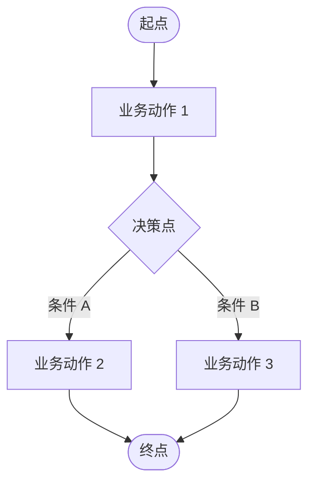
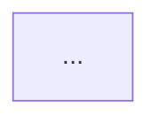
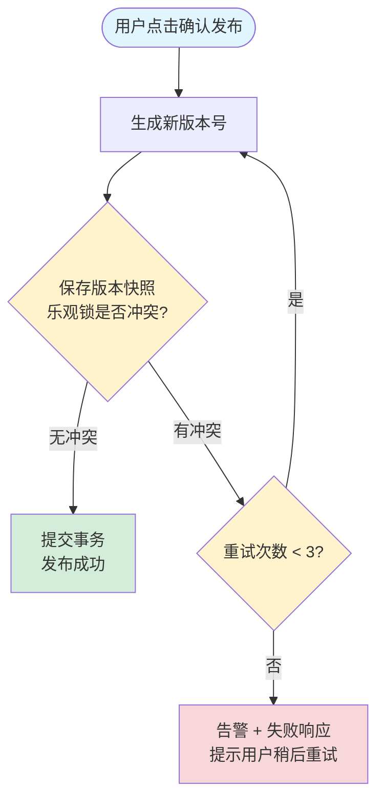

# <X.Y.Z>. <功能名称> 功能设计

## <X.Y.Z>.1. 流程说明

> 用 Mermaid flowchart 画出业务流程。若涉及多个流程，画多张图。

### <X.Y.Z>.1.1 <流程名称 1>



### <X.Y.Z>.1.2 <流程名称 2>（若有）



---

## <X.Y.Z>.2. 功能概述

| 字段 | 内容 |
|---|---|
| 功能菜单 | <菜单名> |
| 功能编号 | FS_<MODULE>_M<NNN> |
| 所属模块 | 【一级模块】-【二级模块】 |
| 对应流程编号 | <如 1.7-0> |
| 功能类型 | ☑ 功能 □ 报表 □ 接口 |
| 功能描述 | 1. <要点 1><br/>2. <要点 2><br/>3. <要点 3> |
| 前置条件 | 1. <前置 1><br/>2. <前置 2> |
| 交互系统 | 1. <交互 1><br/>2. <交互 2> |
| 后置条件 | <后置说明> |
| 关联功能 | 1. <关联 1><br/>2. <关联 2> |

---

## <X.Y.Z>.3. 功能界面

### 主界面 - <功能名>

界面元素说明：
- **页面标题区**：<说明>
- **操作工具栏**：<按钮列举>
- **筛选工具栏**：
  - <筛选项 1>
  - <筛选项 2>
- **数据表格**：展示<对象>列表，包含关键字段
- **分页控件**：支持分页浏览

原型示意：

```
+----------------------------------------------------------+
|  <功能名>                                  [按钮 1][按钮 2]|
+----------------------------------------------------------+
|  筛选: [筛选 1 ▼] [筛选 2 ▼] [搜索______] [查询]          |
+----------------------------------------------------------+
|  列1 | 列2 | 列3 | 操作                                   |
|  ---+-----+-----+----------                              |
|  ...| ... | ... | [行级按钮]                              |
+----------------------------------------------------------+
|                                  第 1/N 页    [< 上 下 >] |
+----------------------------------------------------------+
```

### 子界面 1 - <对话框/弹窗名>

界面元素说明：
- 表单标题：<标题>
- 表单字段：
  - <字段 1>
  - <字段 2>
- 操作按钮：<按钮列举>

原型示意：

```
+------------------------------------------+
|  <对话框标题>                       [X]  |
+------------------------------------------+
|  <字段 1>：[__________________]          |
|  <字段 2>：[下拉 ▼]                      |
|  <字段 3>：[__________________]          |
|                                          |
|                       [取消]   [确定]    |
+------------------------------------------+
```

---

## <X.Y.Z>.4. 关键字段说明

| 字段分组 | 字段名称（中文）| 字段名称（英文）| 数据类型 | 长度 | 必填 | 取值逻辑 |
|---|---|---|---|---|---|---|
| <分组 1> | <中文名> | <english_name> | CHAR | 30 | 是 | 手工输入 |
| <分组 1> | <中文名> | <english_name> | ACL | 5 | 是 | 参考【<XX 配置表>】 |
| <分组 1> | <中文名> | <english_name> | 勾选框 | 1 | 否 | 默认否 |
| <分组 2> | <中文名> | <english_name> | DATE | - | 是 | 日期选择器 |
| <分组 2> | <中文名> | <english_name> | NUM | 10,2 | 是 | 手工输入；范围 ≥ 0 |

> 数据类型枚举：CHAR / NUM / DATE / DATETIME / ACL / 勾选框 / JSON

### 枚举值定义（如有 ≥3 选项的字段）

| 枚举表名称 | 编码 | 名称 |
|---|---|---|
| <XX 配置> | 01 | <名称 1> |
| <XX 配置> | 02 | <名称 2> |
| <XX 配置> | 03 | <名称 3> |

---

## <X.Y.Z>.5. 功能逻辑

### 关键项说明

- **功能按钮**：<按钮列举>
- **关联数据**：<数据对象列举>
- **重点逻辑**：
  1. <重点 1>
  2. <重点 2>
  3. <重点 3>

### 详细功能逻辑

#### 动作 1：<动作名称，如"新增 XX"或"提交 XX">

> **所属模块**：<模块名>
> **触发按钮**：<具体按钮名，如"提交"、"确认发布"、"过账"、"删除"等>
> **操作对象**：<被操作的表单/对象，如"销售订单"、"模板"、"凭证"等>
> **前置条件**：<可选；如有前置才写>

| 执行步骤 | 执行步骤描述 | 标准业务规则 |
|---|---|---|
| 1 | <用户/系统做什么> | <完整中文句：系统应当怎样判断或处理；必要时括号附带英文字段名> |
| 2 | ... | <示例：将业务伙伴信用视图的"未清销售订单占用"金额（open_so_amount）累加上本订单金额> |
| 3 | ... | ... |

#### 动作 2：<动作名称>

> **所属模块**：<模块名>
> **触发按钮**：<按钮名>
> **操作对象**：<对象>
> **前置条件**：<可选>

| 执行步骤 | 执行步骤描述 | 标准业务规则 |
|---|---|---|
| 1 | ... | ... |

#### 动作 3：<动作名称>（定时任务示例）

> **所属模块**：<模块名>
> **触发**：定时任务 — 每日 00:00
> **操作对象**：<被扫描的表/对象>

| 执行步骤 | 执行步骤描述 | 标准业务规则 |
|---|---|---|
| 1 | 扫描某表 | 系统扫描全部记录，按租户分批处理避免长事务 |
| 2 | 更新记录状态 | 将符合条件的记录状态从"待启用"改为"已生效" |

---

### 复杂逻辑表达手段（按需选用；以下为 4 种手段的骨架示例）

> 步骤表是默认主表达方式。遇到复杂逻辑时，**在对应动作的步骤表后追加**以下子节之一或组合。简单动作不需要这些手段。

#### 手段 A 示例：决策表（多条件分支）

**决策表：<场景名，如"信贷检查决策">**

| 条件 \ 规则编号 | R1 | R2 | R3 | R4 |
|---|---|---|---|---|
| 客户信用额度是否充足？ | 是 | 是 | 否 | 否 |
| 订单金额是否超阈值？ | 否 | 是 | 否 | 是 |
| 客户是否在黑名单？ | - | - | - | 是 |
| **→ 系统动作** | 直接通过 | 转入管理员审批 | 拒绝并提示额度不足 | 拒绝并冻结客户 |
| **→ 对应测试用例** | TC-XXX-01 | TC-XXX-02 | TC-XXX-03 | TC-XXX-04 |

> 条件用问句形式；"-"表示该规则下此条件不参与判断；所有可能组合必须 MECE 覆盖。

#### 手段 B 示例：分支流程图（含异常与重试）

**分支流程图：<场景名，如"发布动作的乐观锁处理">**



> 异常路径与主路径视觉对等；循环/重试/降级要显式画出。

#### 手段 C 示例：异常清单表

**异常清单：<动作名，如"发布模板">**

| 异常场景 | 触发条件 | 系统响应 | 用户感知 | 是否阻断 |
|---|---|---|---|---|
| 名称重复 | 校验时发现同名 | 拒绝创建，事务回滚 | 提示"模板名称已存在，请改用其他名称" | 是 |
| 并发删除 | 删除时其他人已改了状态 | 取消删除，事务回滚 | 提示"模板状态已变更，请刷新页面" | 是 |
| 乐观锁冲突 | 版本快照写入时冲突 | 自动重试 3 次 | 显示"系统繁忙，正在重试..."，无需用户操作 | 否 |
| 上游服务超时 | 跨模块影响摘要接口 > 5 秒 | 进入降级模式 | 显示"无法获取影响数据，但可继续操作" + 警告条 | 否 |
| 数据库写入失败 | DB 异常 | 事务回滚 + 错误日志 + 告警 | 提示"系统繁忙，请稍后重试" | 是 |

> 异常清单完整后，§7 错误码表可由本表逐行派生。

#### 手段 D 示例：算法说明（伪代码或编号文字）

**算法说明：<算法名，如"批量结转库存">**

1. **初始化**：
   - 读取本批次待处理数据范围（如本月所有"待结转"状态的库存流水）
   - 设置批次大小 = 100、最大重试次数 = 3、失败阈值 = 50
   - 初始化计数器：成功数 = 0，失败数 = 0

2. **主循环**（每批 100 条）：
   - 2.1 取出下一批待处理数据
   - 2.2 对每条数据：
     - a. 执行业务校验（数量是否平衡、科目是否有效、期间是否打开）
     - b. 校验通过 → 生成结转凭证、更新流水状态为"已结转"
     - c. 校验失败 → 记录失败原因，进入重试队列（最多 3 次）
     - d. 3 次重试仍失败 → 标记为"结转异常"，失败数累计 +1
   - 2.3 提交本批事务

3. **退出条件**（满足任一即退出）：
   - 所有数据处理完毕
   - 失败数 ≥ 失败阈值（50 条）→ 暂停任务并告警
   - 任务超时（>30 分钟）→ 暂停任务并告警

4. **错误处理**：见手段 C 的异常清单

> 编号清晰，便于开发对照实现。关键参数（批次大小、重试次数、阈值）显式给出，便于配置化。

---

## <X.Y.Z>.6. 数据表结构

> 数据类型与 §4 关键字段说明对齐：CHAR / NUM / DATE / DATETIME / ACL / 勾选框 / JSON

### 主表：<中文表名> (`<table_name>`)

> **所属模块**：<模块名>
> **表单名称**：<表单名>
> **表单类型**：新增配置表 / 新增枚举表 / 新增子表单 / 已有表单加字段

| 序号 | 字段ID（英文）| 字段名称（中文）| 数据类型 | 长度 | 必填 | 描述 |
|---|---|---|---|---|---|---|
| 1 | id | 主键 | CHAR | 20 | 是 | 主键 |
| 2 | <english_name> | <中文名> | CHAR | 30 | 是 | <描述> |
| 3 | status | 状态 | CHAR | 20 | 是 | 取值见枚举【<XX 状态配置>】 |
| 4 | create_time | 创建时间 | DATETIME | - | 是 | 创建时间 |
| 5 | create_user | 创建人 | CHAR | 50 | 是 | 创建人 |
| 6 | update_time | 更新时间 | DATETIME | - | 否 | 更新时间 |
| 7 | update_user | 更新人 | CHAR | 50 | 否 | 更新人 |

**索引**：
- UK_<table>_<field>: UNIQUE (<field>) — <用途>
- IDX_<table>_<field>: (<field>) — <用途>

**关键约束**：
- <约束 1>

### 明细表：<中文表名> (`<table_name>`)

> **所属模块**：<模块名>
> **表单名称**：<表单名>
> **表单类型**：新增子表单
> **关联父表单**：<父表单名>

| 序号 | 字段ID（英文）| 字段名称（中文）| 数据类型 | 长度 | 必填 | 描述 |
|---|---|---|---|---|---|---|
| 1 | id | 主键 | CHAR | 20 | 是 | 主键 |
| 2 | <parent_id> | 父表 ID | CHAR | 20 | 是 | 关联<父表> |
| ... | ... | ... | ... | ... | ... | ... |
