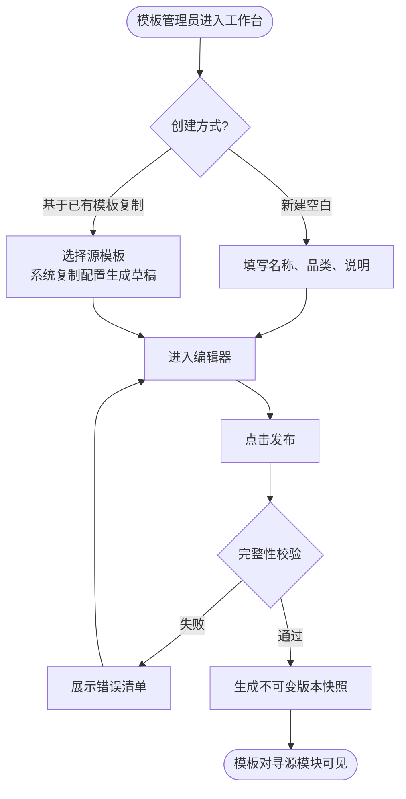

# 示例 1：SRM 报价模板管理 FS（片段）

> 节选自一份完整 FS，展示 fs-writer 输出的典型片段。

---

## 2.1.1.1. 流程说明

### 流程 1：模板创建与发布

---

## 2.1.1.2. 功能概述

| 字段 | 内容 |
|---|---|
| 功能菜单 | 报价模板 |
| 功能编号 | FS_SRM_M001 |
| 所属模块 | 【SRM 报价模块】-【报价模板管理】 |
| 功能类型 | ☑ 功能 □ 报表 □ 接口 |
| 功能描述 | 1. 模板的新建、复制、删除、停用、查询 2. 模板发布与不可变版本快照 3. 启用日期/停用日期的定时生效 |
| 前置条件 | 1. 用户已登录系统 2. 用户具有模板管理员权限 |
| 后置条件 | 模板信息与版本快照保存到数据库，对寻源模块可见 |

---

## 2.1.1.4. 关键字段说明

| 字段分组 | 字段名称（中文）| 字段名称（英文）| 数据类型 | 长度 | 必填 | 取值逻辑 |
|---|---|---|---|---|---|---|
| 模板基础信息 | 模板名称 | name | CHAR | 200 | 是 | 手工输入；1~200 字符；租户内唯一 |
| 模板基础信息 | 品类 | category | CHAR | 100 | 否 | 手工输入或下拉选择 |
| 模板基础信息 | 状态 | status | CHAR | 20 | 是 | 系统按流程自动更新；参考【模板状态配置】|

### 枚举值定义

| 枚举表名称 | 编码 | 名称 |
|---|---|---|
| 模板状态配置 | Draft | 草稿 |
| 模板状态配置 | Published | 已发布 |
| 模板状态配置 | Deprecated | 已停用 |

---

## 2.1.1.5. 功能逻辑

### 动作 1：新建模板

> **所属模块**：SRM 报价 - 报价模板管理
> **触发按钮**：工作台"+ 新建模板"
> **操作对象**：报价模板（quotation_template）

| 执行步骤 | 执行步骤描述 | 标准业务规则 |
|---|---|---|
| 1 | 用户点击"新建模板"按钮 | 系统弹出新建模板对话框 |
| 2 | 用户填写名称、品类（可选）、说明（可选）| 系统校验：模板名称长度必须在 1 至 200 字符之间；品类长度不超过 100 字符；说明长度不超过 500 字符 |
| 3 | 用户点击"确定"按钮 | 系统校验：模板名称非空、长度合法；否则提示对应错误 |
| 4 | 系统校验名称在租户内是否重复 | 系统检查当前租户下是否已存在同名模板（草稿、已发布、已停用三种状态均参与判重）。若已存在，则拒绝创建并提示："模板名称已存在，请改用其他名称" |
| 5 | 系统创建模板与首版草稿 | 系统新建一条报价模板记录（quotation_template），状态设为"草稿"；同时新建一条关联的模板草稿记录（template_draft），行类型暂为空 |
| 6 | 跳转到模板编辑器 | 系统将用户跳转到 FS_SRM_M002 报价模板编辑器 |

---

## 2.1.1.6. 数据表结构

### 主表：报价模板表 (`quotation_template`)

> **所属模块**：SRM 报价 - 报价模板管理
> **表单名称**：报价模板
> **表单类型**：新增配置表

| 序号 | 字段ID（英文）| 字段名称（中文）| 数据类型 | 长度 | 必填 | 描述 |
|---|---|---|---|---|---|---|
| 1 | id | 模板 ID | CHAR | 20 | 是 | 主键 |
| 2 | tenant_id | 租户 ID | CHAR | 20 | 是 | 多租户隔离 |
| 3 | name | 模板名称 | CHAR | 200 | 是 | 租户内唯一 |
| 4 | status | 状态 | CHAR | 20 | 是 | 取值参考【模板状态配置】|

**索引**：
- UK_qt_tenant_name：UNIQUE (tenant_id, name) — 租户内名称唯一

---

## 关键示范点

1. **§1 流程说明用 Mermaid flowchart**：只画业务动作 + 决策点，不画系统组件
2. **§2 功能概述是元数据表**：功能编号嵌入 PRD 目录层级（2.1.1）
3. **§4 关键字段说明字段名中英双写**：业务可读 + 开发精确
4. **数据类型用业务类型**：CHAR/NUM/DATE/ACL/勾选框/JSON，不用 VARCHAR/BIGINT
5. **§5 功能逻辑每个动作含固定头部**：所属模块/触发按钮/操作对象（+ 可选前置条件）
6. **"标准业务规则"列必须完整中文句**：必要时括号附带英文字段名
7. **枚举值独立成表**：不内嵌在取值逻辑列里
