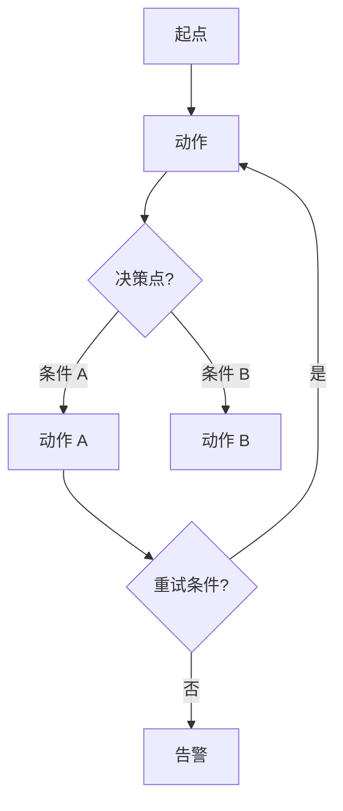
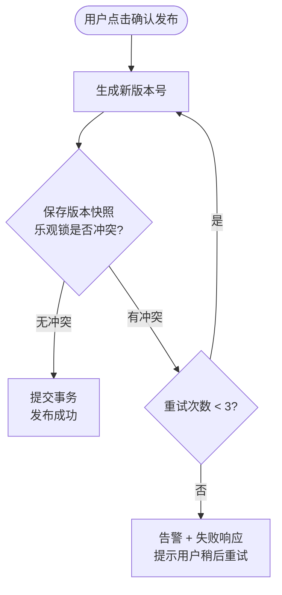

# 复杂逻辑表达手段

按需阅读。步骤表是 §5 功能逻辑的默认表达方式；遇到复杂逻辑时**在该动作的步骤表后追加子节**，使用以下表达手段之一或组合。

简单 CRUD 用步骤表即可，无需引用本文。

---

## 何时引入复杂逻辑表达

| 动作复杂度 | 推荐手段 |
|---|---|
| 简单线性（CRUD）| 仅步骤表 |
| 含 1~2 个判断 | 步骤表（判断写在某步骤的"标准业务规则"列里）|
| 含 3+ 条件组合 | 步骤表 + **决策表** |
| 含分叉与异常路径 | 步骤表 + **分支流程图（Mermaid flowchart）** |
| 需完整覆盖异常 | 步骤表 + **异常清单表** |
| 含循环/重试/算法 | 步骤表 + **算法说明**（伪代码或编号文字）|

---

## 手段 A：决策表（多条件分支）

适用：多个条件按"是/否"组合产生不同结果（典型 if/elif/else 矩阵）。

```
**决策表：<场景名>**

| 条件 \ 规则编号 | R1 | R2 | R3 | R4 |
|---|---|---|---|---|
| <条件 1>？ | 是 | 是 | 否 | 否 |
| <条件 2>？ | 否 | 是 | 否 | 是 |
| <条件 3>？ | - | - | - | 是 |
| **→ 系统动作** | <动作 1> | <动作 2> | <动作 3> | <动作 4> |
```

要求：
- 条件必须用问句形式（"是否充足？"），便于按"是/否"判断
- 规则列必须 MECE（所有可能的组合都被覆盖，不重叠不遗漏）
- "-"表示该规则下此条件不参与判断（don't care）
- 每条规则下方建议括号附测试用例编号（如 R1 → TC-001-01），便于 §8 测试用例追溯

### 决策表示例

**决策表：信贷检查决策**

| 条件 \ 规则编号 | R1 | R2 | R3 | R4 |
|---|---|---|---|---|
| 客户信用额度是否充足？ | 是 | 是 | 否 | 否 |
| 订单金额是否超阈值？ | 否 | 是 | 否 | 是 |
| 客户是否在黑名单？ | - | - | - | 是 |
| **→ 系统动作** | 直接通过 | 转入管理员审批 | 拒绝并提示额度不足 | 拒绝并冻结客户 |
| **→ 对应测试用例** | TC-XXX-01 | TC-XXX-02 | TC-XXX-03 | TC-XXX-04 |

---

## 手段 B：分支流程图（Mermaid flowchart）

适用：主流程含多个决策菱形 + 异常路径 + 循环重试。



要求：
- 决策菱形用问句（"乐观锁是否冲突？"）
- 异常路径与主路径视觉对等，不要把异常隐藏在主路径下方
- 循环、重试、降级路径要显式画出

### 分支流程图示例

**分支流程图：发布动作的乐观锁处理**



---

## 手段 C：异常清单表

适用：需要完整覆盖某动作的全部异常分支。

```
**异常清单：<动作名>**

| 异常场景 | 触发条件 | 系统响应 | 用户感知 | 是否阻断 |
|---|---|---|---|---|
| <场景名> | <什么情况下触发> | <系统怎样处理> | <用户看到什么> | 是 / 否 |
```

要求：
- 异常场景必须有明确名称，便于在错误码表（§7）中追溯
- "是否阻断"区分硬错误（拦截后续）与软警告（继续但提示）
- 异常清单完整后，§7 错误码表可由本表逐行派生

### 异常清单示例

**异常清单：发布模板**

| 异常场景 | 触发条件 | 系统响应 | 用户感知 | 是否阻断 |
|---|---|---|---|---|
| 名称重复 | 校验时发现同名 | 拒绝创建，事务回滚 | 提示"模板名称已存在，请改用其他名称" | 是 |
| 并发删除 | 删除时其他人已改了状态 | 取消删除，事务回滚 | 提示"模板状态已变更，请刷新页面" | 是 |
| 乐观锁冲突 | 版本快照写入时冲突 | 自动重试 3 次 | 显示"系统繁忙，正在重试..."，无需用户操作 | 否 |
| 上游服务超时 | 跨模块影响摘要接口 > 5 秒 | 进入降级模式 | 显示"无法获取影响数据，但可继续操作" + 警告条 | 否 |
| 数据库写入失败 | DB 异常 | 事务回滚 + 错误日志 + 告警 | 提示"系统繁忙，请稍后重试" | 是 |

---

## 手段 D：算法说明（伪代码或编号文字）

适用：含循环、批处理、重试、复杂状态迁移、聚合/计算公式的场景。

要求：
- 编号清晰，便于开发对照实现
- 复杂条件用业务语言（"失败累计超阈值"），不用代码语法（`if failed > threshold`）
- 关键参数（批次大小、重试次数、阈值）显式给出，便于配置化

### 算法说明示例

**算法说明：批量结转库存**

1. **初始化**：
   - 读取本批次待处理数据范围（如本月所有"待结转"状态的库存流水）
   - 设置批次大小 = 100、最大重试次数 = 3、失败阈值 = 50
   - 初始化计数器：成功数 = 0，失败数 = 0

2. **主循环**（每批 100 条）：
   - 2.1 取出下一批待处理数据
   - 2.2 对每条数据：
     - a. 执行业务校验（数量是否平衡、科目是否有效、期间是否打开）
     - b. 校验通过 → 生成结转凭证、更新流水状态为"已结转"
     - c. 校验失败 → 记录失败原因，进入重试队列（最多 3 次）
     - d. 3 次重试仍失败 → 标记为"结转异常"，失败数累计 +1
   - 2.3 提交本批事务

3. **退出条件**（满足任一即退出）：
   - 所有数据处理完毕
   - 失败数 ≥ 失败阈值（50 条）→ 暂停任务并告警
   - 任务超时（>30 分钟）→ 暂停任务并告警

4. **错误处理**：见手段 C 的异常清单

---

## 关于"按需选用"的判断指引

- 写完步骤表后自问：**业务人员/QA 看完能不能正确理解所有分支与异常**？若不能，加补充表达
- 如果只是 1~2 个判断，直接写在"标准业务规则"列里，**不要为了形式而引入决策表**
- 如果某个动作要用 3 个以上手段，考虑这个动作是不是太复杂、需要拆成多个动作
