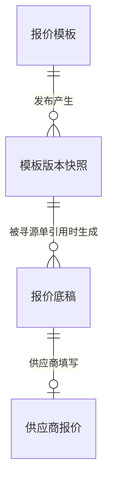

# 示例 1：SRM 报价模块 PRD（片段）

> 节选自一份完整 PRD，展示 prd-writer 输出的典型片段。

---

## 1. 摘要

SRM 报价模块为企业采购方提供**可配置化的供应商报价能力**，覆盖三件事：寻源前的报价模板自助配置、寻源中的供应商在线报价、寻源后的多维比价分析。模块以"业务用户零代码搭建报价表单"为核心理念，支持**标准报价行、分项报价明细、阶梯报价明细**三种报价行类型动态组合。AI 能力作为辅助层注入比价分析环节，不替代采购人的决策权。

---

## 4. 业务实体

### 4.1 实体清单

| 实体 | 简述 |
|---|---|
| 报价模板 | 模板主体；定义供应商应当如何填报价；有生命周期（草稿→已发布→已停用）|
| 模板版本快照 | 模板每次发布产生的不可变快照；被寻源单引用 |
| 报价底稿 | 系统按"模板×物料×受邀供应商"自动生成的预填充表单；供应商在底稿上填值 |
| 供应商报价 | 供应商在底稿上填写并提交的报价数据 |

> **关键纪律**：本节只描述实体的业务概念。字段、表结构、数据类型由下游 FS 派生。

### 4.2 实体关系图

---

## 5. 功能点列表（节选）

### 5.1 子模块 1：报价模板配置

#### FR-1.1 模板工作台与生命周期管理

- **优先级**：P0
- **用户角色**：报价模板管理员
- **场景描述**：模板管理员需要在工作台对企业内所有报价模板做集中管理。他会浏览模板列表、按品类筛选、对已发布模板做停用、对草稿做编辑或删除，并能查看每个模板的版本与引用情况。
- **业务规则**：
  1. 模板状态机：草稿 → 已发布 → 已停用，单向不可逆。停用模板若需重新使用，应基于其复制为新模板
  2. 新建模板初始状态为"草稿"，对寻源模块不可见
  3. 基于现有模板复制时，新模板初始为草稿，名称默认为"原名称-副本"，所有配置项继承，版本号重置为 V1
  4. 仅"草稿"状态可物理删除；已发布/已停用模板只能停用或归档
  5. 已发布模板的停用动作不影响进行中的寻源单（按引用时的版本快照继续运行）
- **验收标准**：
  - 给定已发布的模板被 5 个寻源单引用，当用户点击"删除"时，则系统拒绝并提示"该模板已被 N 个寻源单引用，请改用停用操作"
- **依赖/备注**：依赖 FR-1.5 的版本控制能力

#### FR-1.5 标准报价行内的列计算公式

- **优先级**：**P2（本期不实现；保留为未来扩展锚点）**
- **用户角色**：报价模板管理员
- **场景描述**：模板管理员希望在标准报价行内为某些字段配置计算公式（如"含税单价 = 不含税单价 × (1 + 税率)"），让供应商填写时这些字段自动计算，减少手算错误。本期不实现，仅保留设计意图与 schema 扩展位。
- **业务规则**：
  1. 设计意图：仅在标准报价行内支持同行列计算（如"含税单价 = 不含税单价 × (1 + 税率)"）
  2. 支持的运算：四则、取余、括号、IF 条件函数
  3. 本期 FS 数据层须预留 `formula` 字段位（强约束为 NULL），未来上线时无需破坏性 schema 变更
- **验收标准**：
  - 给定任一字段配置面板，本期不展示"设置计算公式"入口
- **依赖/备注**：本 FR 保留是为锁定未来语义边界，避免后续重新讨论"公式做不做、做到哪"

---

## 6. 范围

### 6.2 范围外（明确不做）

| 排除项 | 排除原因 |
|---|---|
| 寻源单的创建、审批、发布 | 属于寻源模块 |
| 寻源单的附件要求定义与供应商附件上传/存储 | 附件能力完全归属寻源模块 |
| 通知渠道实现（站内信/邮件/短信/IM）| 调用平台标准通知组件；本模块只定义业务事件 |
| 招投标场景（公开招标、邀请招标、密封多轮）| 不在 SRM 报价模块范围 |
| 多币种汇率换算 | 寻源单发布时已指定单一币种 |

---

## 关键示范点

1. **§4 业务实体只描述概念**，没有字段、类型、长度
2. **§5 用"子模块"分组**：本节展示子模块 1（报价模板配置）下的 FR；编号 FR-1.1 / FR-1.5 多级数字
3. **FR 用 7 字段格式**：优先级、用户角色、**场景描述**、业务规则、验收标准、依赖/备注
4. **场景描述自由叙述**：不强制"作为一名用户，我想……，以便……"句式
5. **业务规则用完整中文句**，不写 SQL 或代码
6. **FR-1.5 P2 设计意图保留**：本期不实现但锁定未来语义边界
7. **范围外必含排除原因**，避免范围蔓延争议
