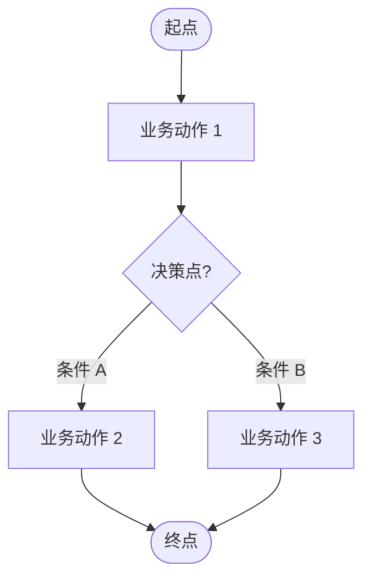
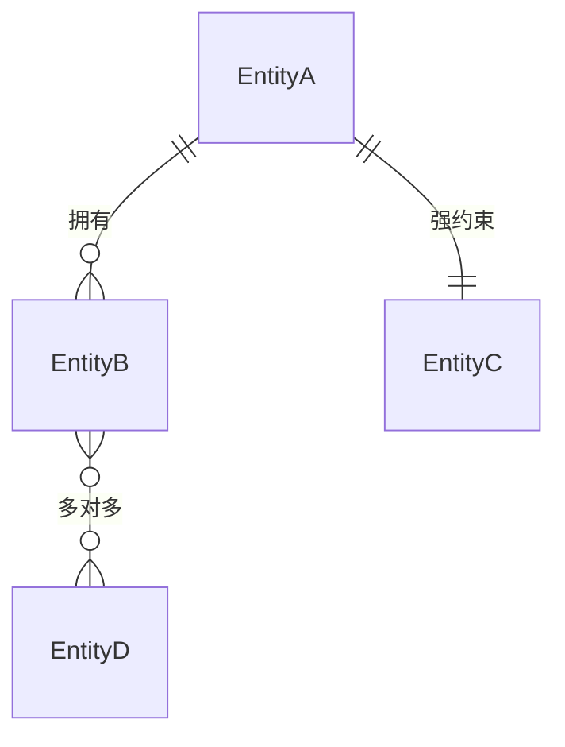

# <模块名称> PRD

> Version：0.1.0
> Author：<姓名>
> Date：<YYYY-MM-DD>
> Status：draft / approved

---

## 1. 摘要

<1-2 段，含三件事：
- 业务背景（一句话说清这是干什么的）
- 目标（要达到什么效果）
- 核心价值（解决什么痛点，对哪类用户）>

---

## 2. 业务上下文

### 2.1 问题陈述

<当前业务的痛点。1-3 条列举，每条用业务语言而不是技术语言。>

### 2.2 目标用户

| 角色 | 描述 | 主要任务 | 使用频率 |
|---|---|---|---|
| <角色名> | <在业务中的职责> | <在本模块的主要任务> | 每日 / 每周 / 偶尔 |

### 2.3 为什么是现在

<触发本次项目的因素：合同截止、客户承诺、内部 OKR、市场变化等。1-3 条。>

---

## 3. 业务流程

> 用 Mermaid flowchart 画核心业务流程。多流程则多图。**不画系统组件**（前端/API/DB），只画业务动作与决策点。

### 3.1 <流程名称 1>

**关键节点说明**（可选）：
- <步骤 X>：<额外业务约束>

### 3.2 <流程名称 2>（如有）

---

## 4. 业务实体

### 4.1 实体清单

| 实体 | 简述（一句话） |
|---|---|
| <实体名 1> | <做什么用的，包含哪些业务概念> |
| <实体名 2> | ... |

> **关键纪律**：本节只描述实体的业务概念，**不写字段、不写表结构、不写数据类型**。字段细节由下游 FS 派生。

### 4.2 实体关系图（可选）

> 仅展示实体名 + 基数关系；不画字段。

---

## 5. 功能点列表

> 按"子模块"分组组织 FR。复杂模块可拆出多个子模块；简单模块只有一个子模块。
> FR 编号采用**多级数字**（FR-1.1 / FR-1.2 / FR-2.1），编号前缀对应子模块号。
> 每条 FR 用 7 字段格式。

### 5.1 子模块 1：<子模块名称，如"模板配置">

#### FR-1.1 <祈使句标题，如"模板工作台管理">

- **优先级**：P0
- **用户角色**：<谁触发或受益>
- **场景描述**：<1-3 句话自由叙述：用户在什么场景下、做什么动作、达到什么目的。不强制 As-I want-So that 句式>
- **业务规则**：
  1. <规则 1，完整中文句>
  2. <规则 2>
  3. <规则 3>
- **验收标准**：
  - 给定 <初始状态>，当 <用户动作> 时，则 <期望结果>
- **依赖/备注**：<可选；引用其他 FR 或外部模块>

#### FR-1.2 <标题>

- **优先级**：P1
- **用户角色**：...
- **场景描述**：...
- **业务规则**：
  1. ...
- **验收标准**：
  - ...
- **依赖/备注**：...

### 5.2 子模块 2：<子模块名称>

#### FR-2.1 <标题>

...

### 优先级汇总

| 优先级 | 数量 | FR 列表 |
|---|---|---|
| P0（本期必须）| N | FR-1.1, FR-2.1, ... |
| P1（本期推荐）| N | FR-1.2, ... |
| P2（设计意图保留）| N | FR-... |

---

## 6. 范围

### 6.1 范围内（本期 P0 + P1）

- <能力 1>
- <能力 2>
- <能力 3>

### 6.2 范围外（明确不做）

| 排除项 | 排除原因 |
|---|---|
| <能力 X> | <为什么不做：属于其他模块 / 资源不够 / 不紧迫 / 复杂度高> |
| <能力 Y> | ... |

> **重要纪律**：本表至少 5 项。如果想不出 5 项，可能是范围还没想清楚。

### 6.3 未来扩展（保留接口/数据扩展点）

- **F1 <能力名>**：<一句话说明未来如何扩展> — 当前 FS 应预留 <什么扩展位>
- **F2 ...**

---

## 7. 待决问题（可选；默认不写）

> 仅当 PRD 写到一半发现某些关键问题需要业务方/客户后续答复时使用。

| ID | 问题 | 影响 | 负责人 | 截止日期 |
|---|---|---|---|---|
| OQ-001 | <问题描述> | <影响哪些 FR / 哪些范围决策> | <角色> | YYYY-MM-DD |

---

## 8. 备注（可选；默认不写）

> 仅当有非典型的约束、依赖、关键假设时使用。

- **关键约束**：<如合规要求、性能门槛、数据隐私等不可妥协项>
- **外部依赖**：<本模块需要哪些外部模块/团队配合>
- **关键假设**：<本 PRD 隐含的假设，违背时需要重新评估>

---

## 给 FS 起草者的提示（可选）

> 默认 FS 拆分约定（无需在此重复）：**一个子模块（§5.N）= 一份 FS**；紧耦合的 FR 同处一个子模块，自然合并到同一 FS。
> 仅当有特殊拆分意图时填写本节。

- **必须独立成 FS 的 FR**（脱离所在子模块）：<如有独立状态机或独立 API 域的 FR>
- **仅需 schema 预留的 P2 FR**：<未来才实现的 FR，FS 仅在数据表中保留字段位>

---

## CHANGELOG

### v0.1.0 — <YYYY-MM-DD>
- 首次发布
